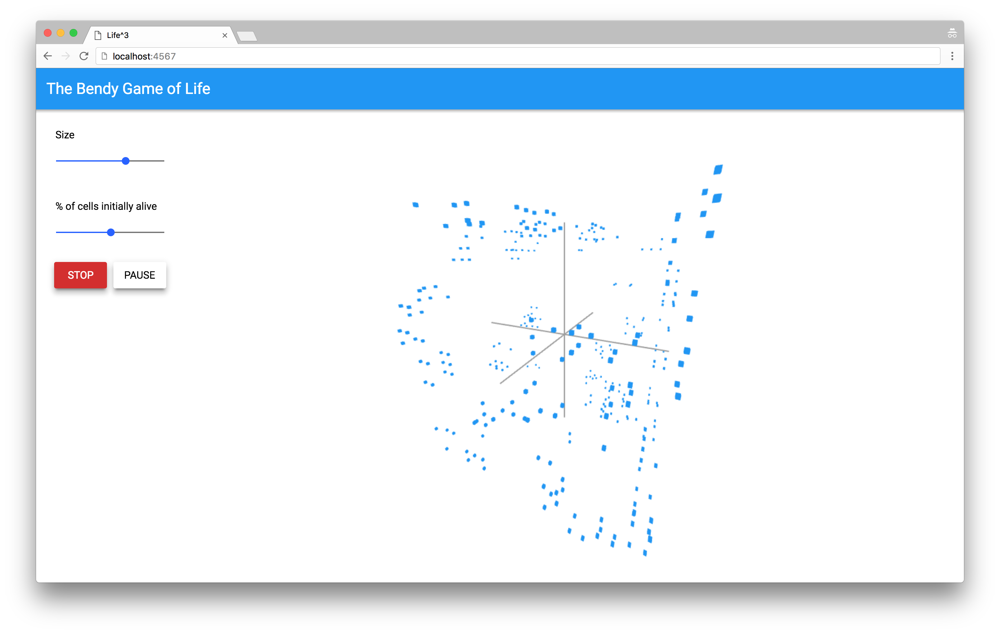

Life
====

In 3D!!!
--------

This is a prototype visualization of [Conway's Game of Life](https://en.wikipedia.org/wiki/Conway%27s_Game_of_Life) represented in 3D. We built this at [Bendyworks](https://bendyworks.com) during our regular professional development time.

(_BTW we are [hiring](https://bendyworks.com/careers)_)

[Demo video](https://www.youtube.com/watch?v=_hewWDDvkMQ)

Getting started
---------------

 1. Install bower and the polymer-cli with `$ npm install -g polymer-cli bower`
 1. Checkout the code `$ git clone git@github.com:bendyworks/life.git`
 1. Run `$ bower install` to install the dependancies
 1. Run `$ polymer serve` to start the server
 1. Open [http://localhost:8080](http://localhost:8080) in your browser
