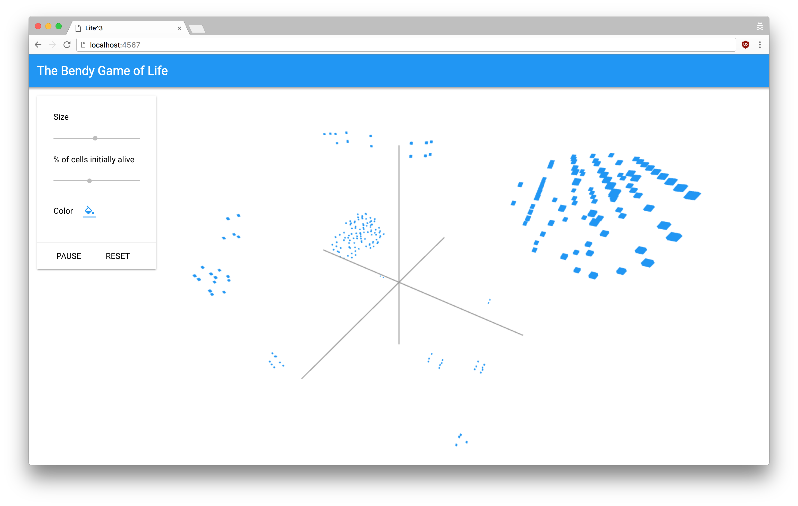

Life
====

In 3D!!!
--------

This is a prototype visualization of [Conway's Game of Life](https://en.wikipedia.org/wiki/Conway%27s_Game_of_Life) represented in 3D. We built this at [Bendyworks](https://bendyworks.com) during our regular professional development time.

(_BTW we are [hiring](https://bendyworks.com/careers)_)

[Demo video](https://www.youtube.com/watch?v=_hewWDDvkMQ)

Getting started
---------------

 1. Download the code
 1. Run `bundle install` to get Ruby dependancies
 1. Run `bower install` to get JS dependancies
 1. Run `ruby go.rb` to start server
 1. Open http://localhost:4567 in your browser
